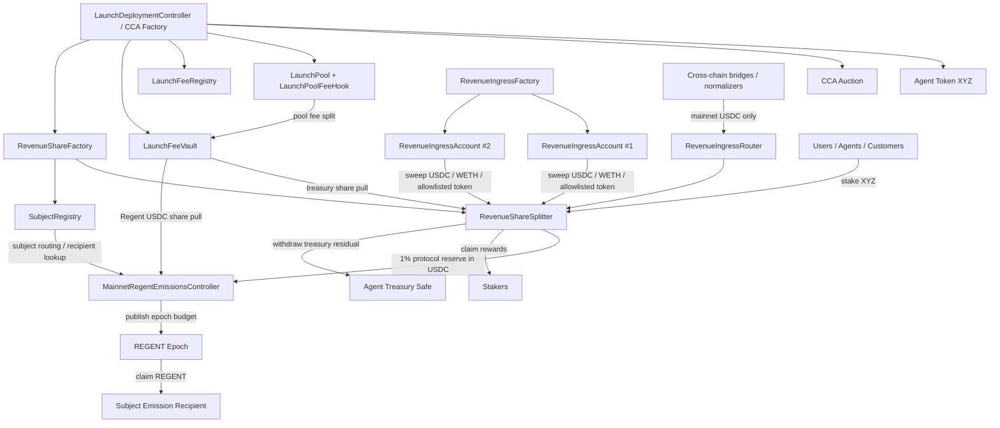

# Autolaunch Cutover Architecture Guide

This guide explains how the **CCA launch stack**, **fee pool hook**, **mainnet revenue splitter**, **subject registry**, **ingress contracts**, and **mainnet REGENT emissions controller** fit together after the hard cutover.

The intended cutover is:

- keep the existing **launch / auction / hook** stack,
- replace the old Ethereum **RevenueRightsHub + ChainRevenueVault** lane with a single **RevenueShareSplitter**,
- replace per-launch routing assumptions with a canonical **SubjectRegistry**,
- move REGENT emissions accounting to a **mainnet-only USDC-based controller**,
- treat bridged or normalized income as recognized **only when it lands on Ethereum mainnet and is swept/deposited there**.

---

## 1. Contract roles at a glance

### Existing launch-side contracts (kept)

- **CCA factory / launch deployment flow**
  - deploys the launch token, auction, pool, and fee plumbing
- **LaunchPoolFeeHook**
  - charges the split fee on pool activity
- **LaunchFeeRegistry**
  - stores per-pool treasury and Regent recipients
- **LaunchFeeVault**
  - stores accrued hook-side fee balances until withdrawn

### New cutover contracts (new mainnet revenue architecture)

- **SubjectRegistry**
  - canonical subject routing keyed by `bytes32 subjectId`
  - links subject -> stake token -> splitter -> treasury safe
  - supports many linked ERC-8004 identities per subject
- **RevenueShareFactory**
  - deploys one `RevenueShareSplitter` per launched stake token
  - registers the subject in `SubjectRegistry`
- **RevenueShareSplitter**
  - canonical staking contract **and** revenue splitter for a subject
  - keeps stake balances onchain
  - accrues rewards with a lazy accumulator
  - books protocol reserve, treasury residual, and dust
- **RevenueIngressRouter**
  - direct payment path for cooperative senders
- **RevenueIngressAccount**
  - sweepable payment/deposit address for invoice-style flows
- **RevenueIngressFactory**
  - deploys many ingress accounts for the same subject / splitter
- **MainnetRegentEmissionsController**
  - mainnet-only REGENT emissions accounting and claims
  - scores subjects by recognized **mainnet USDC**
  - publishes claimable REGENT budget per epoch

### Optional / legacy

- **RegentEmissionsDistributorV2**
  - safer Merkle distributor with recipient frozen in the leaf
  - useful if you still want a Merkle-style distributor for a non-mainnet lane
  - not the preferred long-term mainnet emissions design

---

## 2. Big-picture diagram

### Mermaid



### ASCII fallback

```text
                            +--------------------------------+
                            | LaunchDeployment / CCA Factory |
                            +--------------------------------+
                               | token / auction / pool / hook
                               v
+------------+     +-------------------+     +----------------------+
| Agent XYZ  |<--->| CCA Auction / Pool|<--->| LaunchPoolFeeHook    |
+------------+     +-------------------+     +----------------------+
                                                       |
                                                       v
                                           +----------------------+
                                           | LaunchFeeVault       |
                                           +----------------------+
                                              | treasury share pull
                                              v
+----------------------+     direct deposit / sweep      +----------------------+
| RevenueIngressRouter |-------------------------------> | RevenueShareSplitter |
+----------------------+                                  | - staking            |
                                                          | - accumulators       |
+----------------------+     sweep allowlisted token      | - treasury residual  |
| Ingress Accounts     |-------------------------------> | - protocol reserve   |
+----------------------+                                  +----------------------+
                                                                  |         |
                                                                  |         +--> staker claims
                                                                  |
                                                                  +--> treasury withdrawals
                                                                  |
                                                                  +--> USDC protocol reserve pull
                                                                                |
                                                                                v
                                                               +-------------------------------+
                                                               | MainnetRegentEmissionsCtrl    |
                                                               | - per-subject USDC scoring    |
                                                               | - epoch REGENT budget         |
                                                               | - subject claims              |
                                                               +-------------------------------+
```

---

## 3. The launch flow

### Step 1: launch deployment

The launch path still starts with the CCA factory / deployment controller.

It deploys or wires:

- the launch token (`XYZ`),
- the CCA auction,
- the launch pool,
- the fee hook plumbing,
- the subject routing / splitter for the post-launch revenue lane.

In the cutover model, the launch deployment should additionally:

1. create a `subjectId`,
2. deploy the subject's `RevenueShareSplitter` through `RevenueShareFactory`,
3. register the subject in `SubjectRegistry`,
4. configure the launch fee recipients so the right mainnet contracts can later pull the hook-side shares,
5. optionally deploy one or more ingress accounts.

### Why keep the CCA side separate?

CCA is for **initial price discovery and initial budget formation**.
The splitter is for **ongoing revenue rights and staking**.

Keeping them separate lets you preserve the launch mechanics while simplifying ongoing rewards.

---

## 4. The fee hook lane

The pool hook is a **launch-side fee lane**, not the same thing as subject operating income.

### What the hook does

`LaunchPoolFeeHook` charges the split fee on pool activity.
The `LaunchFeeVault` then holds those balances.

Important consequence:

- hook-side fees can accrue in the pool's fee currency,
- that may be quote token, WETH, native ETH, or even the launch token depending on pool setup,
- those balances are **not automatically normalized into USDC**.

### How hook fees enter the cutover system

There are two useful paths:

#### A. Treasury share -> subject splitter

The subject can pull the hook-side **treasury share** from `LaunchFeeVault` into `RevenueShareSplitter` using:

- `pullTreasuryShareFromLaunchVault(...)`

Once pulled, that value becomes recognized splitter revenue and is split between:

- stakers,
- treasury residual,
- protocol reserve.

#### B. Regent share -> emissions controller

If the hook-side Regent share accrued in **USDC**, the mainnet emissions controller can pull it directly using:

- `pullLaunchVaultUsdc(...)`

If the hook-side Regent share accrued in non-USDC assets, it should be normalized off-contract first, then credited as mainnet USDC.

---

## 5. The operating-income lane

This is the main cutover lane.

### Path A: cooperative sender uses router

A sender who knows the subject ID can send revenue directly with:

- `RevenueIngressRouter.depositToken(...)`
- `RevenueIngressRouter.depositNative(...)`

This is the cleanest path because the splitter is credited immediately.

### Path B: invoice / payment address via ingress account

A subject can have many `RevenueIngressAccount` contracts.

Those accounts can:

- receive native ETH directly,
- receive allowlisted ERC-20 tokens,
- be swept later by anyone.

A sweep then forwards the whole balance into the subject's splitter.

### Cross-chain income rule

For v1, cross-chain income should count **only when it lands on Ethereum mainnet and is deposited / swept into the subject's splitter**.

That means:

- staking state stays canonical on mainnet,
- no remote chain needs current staker state,
- bridges only move value,
- mainnet contracts do all accounting.

---

## 6. The splitter: staking + reward accrual in one contract

`RevenueShareSplitter` replaces the old split between a staking hub and a separate vault.

It stores:

- `stakedBalance[user]`
- `totalStaked`
- `accRewardPerToken[rewardToken]`
- `rewardDebt[user][rewardToken]`
- `storedClaimable[user][rewardToken]`
- `treasuryResidual[rewardToken]`
- `protocolReserve[rewardToken]`
- `undistributedDust[rewardToken]`

### Core rule

For a recognized reward deposit `A` in reward token `R`:

1. take the protocol skim first,
2. distribute the rest according to **stake / totalSupply()**,
3. leave the unstaked-share remainder in treasury residual,
4. never iterate over all stakers.

### Exact math

For reward amount `A`:

- `protocol = floor(A * protocolSkimBps / 10_000)`
- `net = A - protocol`
- `deltaAcc = floor(net * ACC_PRECISION / totalSupply())`
- `accRewardPerToken[R] += deltaAcc`
- `stakerEntitlement = floor(net * totalStaked / totalSupply())`
- `treasuryResidual[R] += net - stakerEntitlement`
- any rounding gap between `stakerEntitlement` and what the accumulator actually credits is tracked as `undistributedDust[R]`

### Why this matters

This implements:

> a staker with `x` tokens receives `x / totalSupply()` of the post-skim inflow

That is the intended economics for a revenue-rights token where unstaked supply leaves value with the agent treasury.

### No global poke

There is no need for a generic `poke()` that loops through users.

Instead:

- `deposit*` and `sweep*` update **global** reward state,
- `stake`, `unstake`, and `claim` sync **only the caller**.

That keeps gas bounded.

---

## 7. The emissions lane

### Mainnet-first design

The preferred emissions design is now:

- bridge or normalize value into **mainnet USDC**,
- credit it to a subject in `MainnetRegentEmissionsController`,
- publish a REGENT budget for the closed epoch,
- let the subject claim its REGENT share.

### Why USDC-only for emissions scoring?

Because this avoids embedding price oracles and token conversion logic into the emissions contract.

The emissions controller should score only:

- USDC pulled from each subject splitter's `protocolReserve[USDC]`,
- USDC pulled from launch hook Regent share when the hook accrued in USDC,
- direct USDC credits from bridge / normalizer adapters.

### Mainnet emissions flow

1. subject earns recognized mainnet USDC,
2. emissions controller credits that USDC to `subjectRevenueUsdc[epoch][subjectId]`,
3. after epoch close, publisher funds REGENT and calls `publishEpochEmission(epoch, emissionAmount)`,
4. subject claims:

```text
subject share = subjectRevenueUsdc / epoch.totalRecognizedUsdc
claimable REGENT = emissionAmount * subject share
```

### Recipient safety

The mainnet controller snapshots the subject recipient the first time that subject is credited in an epoch, so old-epoch routing cannot be silently changed later.

---

## 8. Recommended deployment / wiring

For each new launch:

1. deploy launch token and CCA side,
2. deploy `RevenueShareSplitter` through `RevenueShareFactory`,
3. register the subject in `SubjectRegistry`,
4. set subject treasury safe as subject manager,
5. create mainnet ingress accounts if desired,
6. allowlist reward tokens on the splitter,
7. set splitter `protocolRecipient` to the mainnet emissions controller,
8. set launch hook `regentRecipient` to the mainnet emissions controller if you want hook-side USDC Regent fees to count directly,
9. optionally configure launch-vault USDC route in the emissions controller.

---

## 9. Trust boundaries

### The splitter is mostly trust-minimized

Once a deposit is recognized by the splitter, claim math is fully onchain.
There is no Merkle tree for staker rewards and no offchain completeness problem for staker lists.

### The emissions controller still has a small publication boundary

The controller stores per-subject USDC onchain, but someone still chooses the REGENT budget per epoch.
That is a much smaller trust boundary than “publisher builds the whole payout tree.”

### Bridge / normalization is outside the core contract trust model

If income originates on another chain or in non-USDC assets, it only becomes protocol-recognized emissions input once it lands as mainnet USDC and is credited.

---

## 10. What is intentionally *not* in v1

- no remote-chain staking state
- no automatic onchain ETH/WETH/agent-token -> USD conversion in the emissions rail
- no generic loop over all stakers
- no attempt to make raw ERC-20 transfers auto-run logic at the destination

---

## 11. Suggested future additions

- `MainnetBridgeReceiver.sol` for controlled bridge-credit entrypoints
- CCTP-only USDC bridge adapter demos
- deeper integration in launch deployment scripts
- monitoring jobs for unswept ingress balances and stale treasury residuals
- optional yield management for treasury residual before exploring staker-side vault shares
